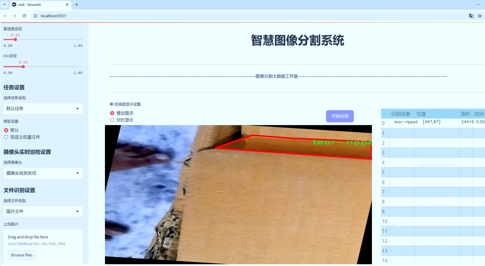
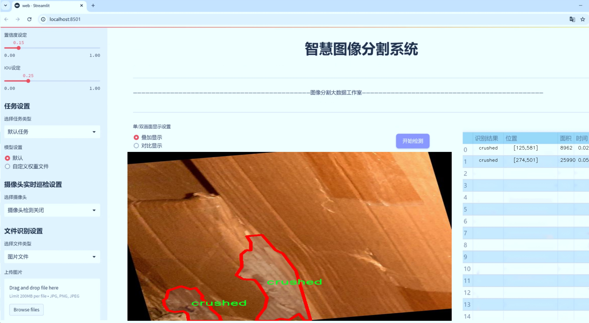
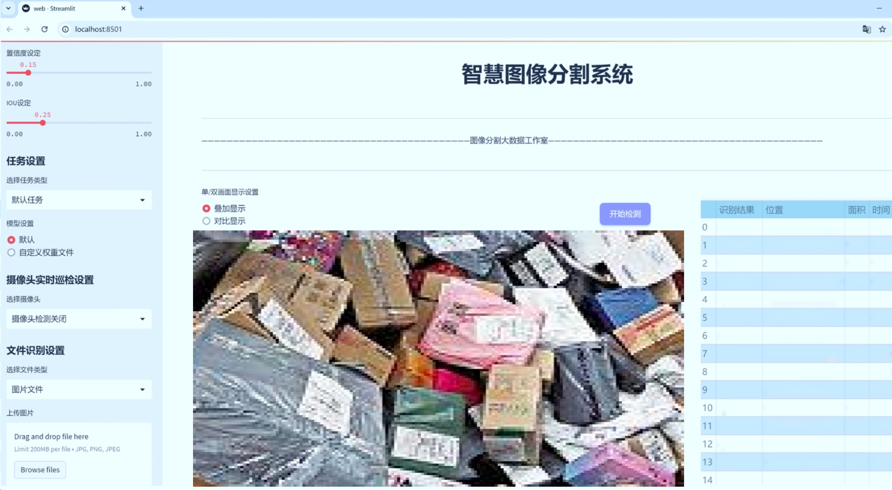
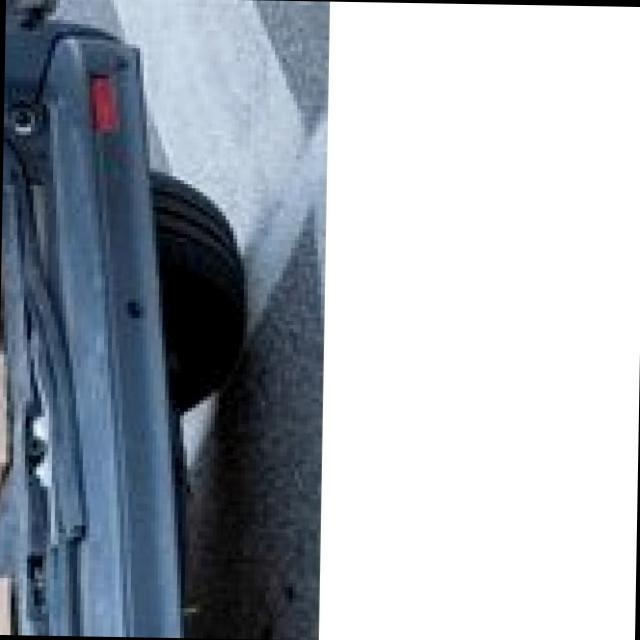
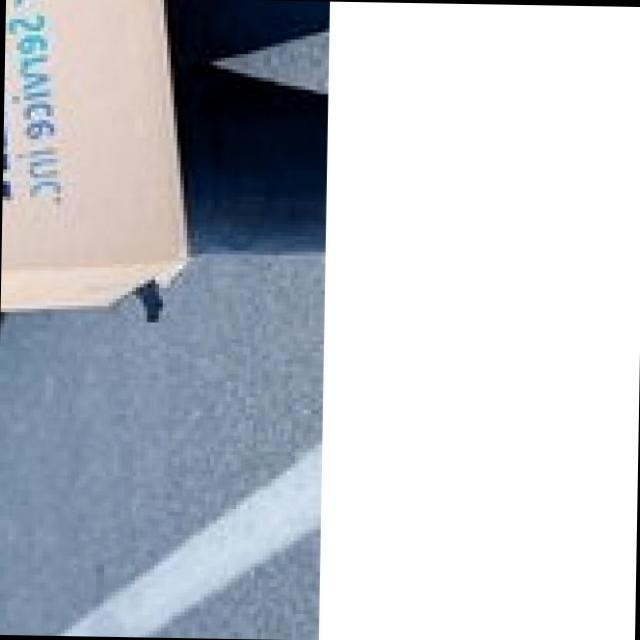
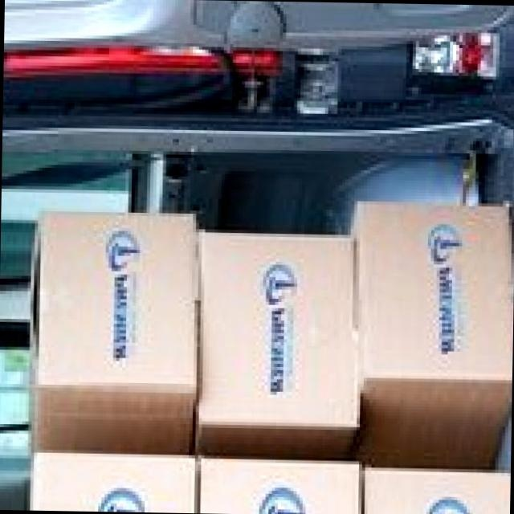

# 快递包装箱损伤识别图像分割系统： yolov8-seg-timm

### 1.研究背景与意义

[参考博客](https://gitee.com/YOLOv8_YOLOv11_Segmentation_Studio/projects)

[博客来源](https://kdocs.cn/l/cszuIiCKVNis)

研究背景与意义

随着电子商务的迅猛发展，快递行业的规模不断扩大，快递包装箱的损伤问题日益凸显。根据统计数据，快递运输过程中，包装箱的损坏率高达20%，这不仅给消费者带来了不便，也对快递公司造成了经济损失。包装箱的损伤不仅影响了商品的安全性和完整性，还可能导致消费者对品牌的信任度下降。因此，如何有效地识别和分类快递包装箱的损伤，成为了快递行业亟待解决的技术难题。

传统的包装箱损伤检测方法多依赖人工检查，效率低下且容易受到人为因素的影响，难以实现高效、准确的损伤识别。近年来，深度学习技术的快速发展为图像处理领域带来了新的机遇，尤其是目标检测和图像分割技术的进步，使得自动化损伤识别成为可能。YOLO（You Only Look Once）系列模型以其高效的实时检测能力和较高的准确率，逐渐成为目标检测领域的主流方法。YOLOv8作为该系列的最新版本，具备了更强的特征提取能力和更快的推理速度，适合于复杂场景下的损伤识别任务。

本研究旨在基于改进的YOLOv8模型，构建一个高效的快递包装箱损伤识别图像分割系统。该系统将利用包含1700张图像的“Object detection Damage 2”数据集进行训练和测试。该数据集涵盖了五种主要的损伤类别：压扁、孔洞、划痕/裂缝、角落收缩和撕裂/破损。这些类别的多样性为模型的训练提供了丰富的样本，能够有效提升模型在实际应用中的泛化能力。

通过对YOLOv8模型的改进，我们将重点优化其在小目标检测和复杂背景下的表现，以提高模型对快递包装箱损伤的识别精度。此外，图像分割技术的引入将使得损伤区域的边界更加清晰，便于后续的分析和处理。这一系统的实现不仅能够提高快递行业对包装箱损伤的识别效率，还能为损伤数据的统计分析提供支持，帮助企业优化包装设计和运输流程，从而降低损坏率，提升客户满意度。

综上所述，基于改进YOLOv8的快递包装箱损伤识别图像分割系统的研究具有重要的理论意义和实际应用价值。它不仅推动了深度学习技术在快递行业的应用，还为后续的相关研究提供了基础。通过这一系统的实施，快递企业能够更好地应对包装损伤问题，提高运营效率，进而在激烈的市场竞争中占据优势地位。

### 2.图片演示







注意：本项目提供完整的训练源码数据集和训练教程,由于此博客编辑较早,暂不提供权重文件（best.pt）,需要按照6.训练教程进行训练后实现上图效果。

### 3.视频演示

[3.1 视频演示](https://www.bilibili.com/video/BV1Zq6AY1E6z/)

### 4.数据集信息

##### 4.1 数据集类别数＆类别名

nc: 5
names: ['crushed', 'hole', 'scratched-cracked', 'shrunken-corner', 'tear-ripped']


##### 4.2 数据集信息简介

数据集信息展示

在现代物流行业中，快递包装箱的损伤识别显得尤为重要。为了提升这一领域的图像分割技术，特别是针对YOLOv8-seg模型的改进，我们构建了一个名为“Object detection Damage 2”的数据集。该数据集专注于快递包装箱的损伤类型，通过对多种损伤情况的标注与分类，为深度学习模型的训练提供了丰富的样本。

“Object detection Damage 2”数据集包含五个主要的损伤类别，分别是“crushed”（压扁）、“hole”（孔洞）、“scratched-cracked”（划伤或裂缝）、“shrunken-corner”（角落缩小）和“tear-ripped”（撕裂）。这些类别涵盖了快递包装箱在运输和处理过程中可能遭遇的各种损伤情况，具有较强的现实意义和应用价值。每个类别的样本均经过精心挑选和标注，确保数据的多样性和代表性，以便于模型在实际应用中能够准确识别和分类不同类型的损伤。

在数据集的构建过程中，我们不仅关注样本的数量，还特别重视样本的质量。每个损伤类别的图像均经过严格筛选，确保其清晰度和标注的准确性。数据集中包含的图像来自于不同的快递包装箱，涵盖了多种材质、尺寸和颜色的包装箱，以增强模型的泛化能力。通过这种方式，我们希望模型能够在面对不同类型的快递包装箱时，依然保持高效的识别和分割能力。

此外，为了进一步提升模型的训练效果，我们对数据集进行了多样化处理，包括图像增强、旋转、缩放和颜色调整等操作。这些处理不仅增加了数据集的规模，还帮助模型更好地适应各种环境和条件下的图像输入。通过这种方式，我们希望能够提升YOLOv8-seg模型在快递包装箱损伤识别任务中的表现，使其在实际应用中具备更高的准确性和鲁棒性。

数据集的标注信息采用了先进的标注工具，确保每个损伤区域的边界都被精确地框定。这种精细的标注方式为模型的训练提供了可靠的监督信号，使得模型能够学习到更为细致的特征。随着深度学习技术的不断发展，图像分割在损伤识别中的应用前景广阔，而“Object detection Damage 2”数据集正是推动这一领域进步的重要基础。

总之，“Object detection Damage 2”数据集为改进YOLOv8-seg的快递包装箱损伤识别图像分割系统提供了坚实的数据支持。通过丰富的样本、多样化的处理和精确的标注，我们期待这一数据集能够在未来的研究和应用中发挥重要作用，助力物流行业的智能化发展。








### 5.项目依赖环境部署教程（零基础手把手教学）

[5.1 环境部署教程链接（零基础手把手教学）](https://www.bilibili.com/video/BV1jG4Ve4E9t/?vd_source=bc9aec86d164b67a7004b996143742dc)


[5.2 安装Python虚拟环境创建和依赖库安装视频教程链接（零基础手把手教学）](https://www.bilibili.com/video/BV1nA4VeYEze/?vd_source=bc9aec86d164b67a7004b996143742dc)

### 6.手把手YOLOV8-seg训练视频教程（零基础手把手教学）

[6.1 手把手YOLOV8-seg训练视频教程（零基础小白有手就能学会）](https://www.bilibili.com/video/BV1cA4VeYETe/?vd_source=bc9aec86d164b67a7004b996143742dc)


按照上面的训练视频教程链接加载项目提供的数据集，运行train.py即可开始训练



     Epoch   gpu_mem       box       obj       cls    labels  img_size
     1/200     0G   0.01576   0.01955  0.007536        22      1280: 100%|██████████| 849/849 [14:42<00:00,  1.04s/it]
               Class     Images     Labels          P          R     mAP@.5 mAP@.5:.95: 100%|██████████| 213/213 [01:14<00:00,  2.87it/s]
                 all       3395      17314      0.994      0.957      0.0957      0.0843

     Epoch   gpu_mem       box       obj       cls    labels  img_size
     2/200     0G   0.01578   0.01923  0.007006        22      1280: 100%|██████████| 849/849 [14:44<00:00,  1.04s/it]
               Class     Images     Labels          P          R     mAP@.5 mAP@.5:.95: 100%|██████████| 213/213 [01:12<00:00,  2.95it/s]
                 all       3395      17314      0.996      0.956      0.0957      0.0845

     Epoch   gpu_mem       box       obj       cls    labels  img_size
     3/200     0G   0.01561    0.0191  0.006895        27      1280: 100%|██████████| 849/849 [10:56<00:00,  1.29it/s]
               Class     Images     Labels          P          R     mAP@.5 mAP@.5:.95: 100%|███████   | 187/213 [00:52<00:00,  4.04it/s]
                 all       3395      17314      0.996      0.957      0.0957      0.0845


### 7.50+种全套YOLOV8-seg创新点加载调参实验视频教程（一键加载写好的改进模型的配置文件）

[7.1 50+种全套YOLOV8-seg创新点加载调参实验视频教程（一键加载写好的改进模型的配置文件）](https://www.bilibili.com/video/BV1Hw4VePEXv/?vd_source=bc9aec86d164b67a7004b996143742dc)

### YOLOV8-seg算法简介

原始YOLOv8-seg算法原理

YOLOv8-seg算法是目标检测和图像分割领域的一项重要进展，作为YOLO系列的最新版本，它在多个方面进行了显著的改进，旨在提高模型的性能和灵活性。YOLOv8-seg的设计理念基于快速、准确和易于使用的原则，尤其在处理复杂的视觉任务时，展现出了其独特的优势。

首先，YOLOv8-seg的网络结构可以分为三个主要部分：Backbone、Neck和Head。Backbone部分负责特征提取，Neck部分则负责特征融合，而Head部分则实现了目标检测和分割的最终输出。与之前的YOLO版本相比，YOLOv8-seg在Backbone中引入了C2F模块，这一模块的设计灵感来源于YOLOv7中的ELAN模块。C2F模块通过并行化更多的梯度流分支，丰富了网络在特征提取过程中的信息流动，从而提高了模型的精度和效率。

在Neck部分，YOLOv8-seg采用了FPN（特征金字塔网络）和PAN（路径聚合网络）的结合，进一步增强了多尺度特征的融合能力。FPN-PAN结构能够有效地将不同层次的特征进行整合，使得模型在处理不同大小的目标时表现得更加灵活和精准。此外，YOLOv8-seg在Neck部分去除了多次的上采样操作，直接对Backbone不同阶段输出的特征进行上采样，这一设计简化了网络结构，同时也减少了计算复杂度。

YOLOv8-seg的Head部分是其最大的创新之一，采用了解耦头（Decoupled Head）结构。这一结构将分类和定位任务分开处理，分别通过两个独立的卷积分支进行特征提取和输出。这种解耦设计使得模型在处理复杂场景时，能够更好地专注于不同任务的特征学习，从而提高了检测和分割的精度。此外，YOLOv8-seg还引入了无锚框（Anchor-Free）的方法，摒弃了传统的基于锚框的目标检测策略。通过将目标检测转化为关键点检测，YOLOv8-seg在训练时不再依赖于预设的锚框，这一创新不仅提高了模型的泛化能力，也使得网络结构更加简洁。

在数据预处理方面，YOLOv8-seg继承了YOLOv5的策略，采用了多种数据增强手段，如马赛克增强、混合增强、空间扰动和颜色扰动等。这些增强技术能够有效地提高模型的鲁棒性，使其在面对不同的输入数据时，依然能够保持良好的性能。特别是在训练过程中，马赛克增强通过随机拼接多张图像，迫使模型学习到更多的上下文信息，从而提高了目标检测和分割的精度。

YOLOv8-seg在标签分配策略上也进行了重要的改进。与YOLOv5依赖于候选框聚类的方式不同，YOLOv8-seg采用了动态标签分配策略，确保在不同尺度的样本中，正负样本的匹配更加合理。这一策略不仅提高了训练效率，也使得模型在面对复杂场景时，能够更好地适应数据的分布特征。分类损失方面，YOLOv8-seg引入了Varifocal Loss（VFL），该损失函数通过对正负样本进行加权处理，使得模型能够更加关注高质量的正样本，从而提升整体的检测精度。

在模型的实际应用中，YOLOv8-seg展现出了极高的灵活性和适应性。无论是在目标检测还是图像分割任务中，YOLOv8-seg都能够以更快的推理速度和更高的精度完成任务。这使得YOLOv8-seg成为了计算机视觉领域中一个极具竞争力的选择，广泛应用于自动驾驶、安防监控、医疗影像分析等多个领域。

综上所述，YOLOv8-seg算法通过一系列的创新和改进，不仅在性能上超越了前代模型，还在易用性和灵活性上做出了显著提升。其独特的网络结构设计、先进的数据处理策略以及高效的标签分配机制，使得YOLOv8-seg在目标检测和图像分割领域中，成为了一种强有力的工具。随着计算机视觉技术的不断发展，YOLOv8-seg无疑将在未来的研究和应用中发挥更大的作用。


### 9.系统功能展示（检测对象为举例，实际内容以本项目数据集为准）

图9.1.系统支持检测结果表格显示

  图9.2.系统支持置信度和IOU阈值手动调节

  图9.3.系统支持自定义加载权重文件best.pt(需要你通过步骤5中训练获得)

  图9.4.系统支持摄像头实时识别

  图9.5.系统支持图片识别

  图9.6.系统支持视频识别

  图9.7.系统支持识别结果文件自动保存

  图9.8.系统支持Excel导出检测结果数据


### 10.50+种全套YOLOV8-seg创新点原理讲解（非科班也可以轻松写刊发刊，V11版本正在科研待更新）

#### 10.1 由于篇幅限制，每个创新点的具体原理讲解就不一一展开，具体见下列网址中的创新点对应子项目的技术原理博客网址【Blog】：


[10.1 50+种全套YOLOV8-seg创新点原理讲解链接](https://gitee.com/qunmasj/good)

#### 10.2 部分改进模块原理讲解(完整的改进原理见上图和技术博客链接)【如果此小节的图加载失败可以通过CSDN或者Github搜索该博客的标题访问原始博客，原始博客图片显示正常】
### YOLOv8简介

YOLOv8是一种最新的SOTA算法，提供了N/S/M/L/X尺度的不同大小模型，以满足不同场景的需求。本章对算法网络的新特性进行简要介绍。


1）骨干网络和Neck
开发者设计了C2f模块对CSPDarkNet 53和PAFPN进行改造。相比C3模块，C2f模块拥有更多的分支跨层链接，使模型的梯度流更加丰富，显著增强了模型的特征提取能力。
2)Head部分
Head部分采用无锚框设计，将分类任务和回归任务进行了解耦，独立的分支将更加专注于其所负责的特征信息。
3）损失计算
模型使用CIOU Loss作为误差损失函数，并通过最小化DFL进一步提升边界框的回归精度。同时模型采用了TaskAlignedAssigner样本分配策略，以分类得分和IOU的高阶组合作为指标指导正负样本选择，实现了高分类得分和高IOU的对齐，有效地提升了模型的检测精度。


### D-LKA Attention简介
自2010年代中期以来，卷积神经网络（CNNs）已成为许多计算机视觉应用的首选技术。它们能够从原始数据中自动提取复杂的特征表示，无需手动进行特征工程，这引起了医学图像分析社区的极大兴趣。许多成功的CNN架构，如U-Net、全卷积网络、DeepLab或SegCaps（分割胶囊），已经被开发出来。这些架构在语义分割任务中取得了巨大成功，先前的最新方法已经被超越。

在计算机视觉研究中，不同尺度下的目标识别是一个关键问题。在CNN中，可检测目标的大小与相应网络层的感受野尺寸密切相关。如果一个目标扩展到超出这个感受野的边界，这可能会导致欠分割结果。相反，与目标实际大小相比使用过大的感受野可能会限制识别，因为背景信息可能会对预测产生不必要的影响。

解决这个问题的一个有希望的方法涉及在并行使用具有不同尺寸的多个Kernel，类似于Inception块的机制。然而，由于参数和计算要求的指数增长，将Kernel大小增加以容纳更大的目标在实践中受到限制。因此，出现了各种策略，包括金字塔池化技术和不同尺度的扩张卷积，以捕获多尺度的上下文信息。

另一个直观的概念涉及将多尺度图像金字塔或它们的相关特征表示直接纳入网络架构。然而，这种方法存在挑战，特别是在管理训练和推理时间方面的可行性方面存在挑战。在这个背景下，使用编码器-解码器网络，如U-Net，已被证明是有利的。这样的网络在较浅的层中编码外观和位置，而在更深的层中，通过神经元的更广泛的感受野捕获更高的语义信息和上下文信息。

一些方法将来自不同层的特征组合在一起，或者预测来自不同尺寸的层的特征以使用多尺度的信息。此外，出现了从不同尺度的层中预测特征的方法，有效地实现了跨多个尺度的见解整合。然而，大多数编码器-解码器结构面临一个挑战：它们经常无法在不同尺度之间保持一致的特征，并主要使用最后一个解码器层生成分割结果。

语义分割是一项任务，涉及根据预定义的标签集为图像中的每个像素预测语义类别。这项任务要求提取高级特征同时保留初始的空间分辨率。CNNs非常适合捕获局部细节和低级信息，尽管以忽略全局上下文为代价。视觉Transformer（ViT）架构已经成为解决处理全局信息的视觉任务的关键，包括语义分割，取得了显著的成功。

ViT的基础是注意力机制，它有助于在整个输入序列上聚合信息。这种能力使网络能够合并远程的上下文提示，超越了CNN的有限感受野尺寸。然而，这种策略通常会限制ViT有效建模局部信息的能力。这种局限可能会妨碍它们检测局部纹理的能力，这对于各种诊断和预测任务至关重要。这种缺乏局部表示可以归因于ViT模型处理图像的特定方式。

ViT模型将图像分成一系列Patch，并使用自注意力机制来模拟它们之间的依赖关系。这种方法可能不如CNN模型中的卷积操作对感受野内提取局部特征有效。ViT和CNN模型之间的这种图像处理方法的差异可能解释了CNN模型在局部特征提取方面表现出色的原因。

近年来，已经开发出创新性方法来解决Transformer模型内部局部纹理不足的问题。其中一种方法是通过互补方法将CNN和ViT特征结合起来，以结合它们的优势并减轻局部表示的不足。TransUNet是这种方法的早期示例，它在CNN的瓶颈中集成了Transformer层，以模拟局部和全局依赖关系。HiFormer提出了一种解决方案，将Swin Transformer模块和基于CNN的编码器结合起来，生成两个多尺度特征表示，通过Double-Level Fusion模块集成。UNETR使用基于Transformer的编码器和CNN解码器进行3D医学图像分割。CoTr和TransBTS通过Transformer在低分辨率阶段增强分割性能，将CNN编码器和解码器连接在一起。

增强局部特征表示的另一种策略是重新设计纯Transformer模型内部的自注意力机制。在这方面，Swin-Unet在U形结构中集成了一个具有线性计算复杂性的Swin Transformer块作为多尺度 Backbone 。MISSFormer采用高效Transformer来解决视觉Transformer中的参数问题，通过在输入块上进行不可逆的降采样操作。D-Former引入了一个纯Transformer的管道，具有双重注意模块，以分段的方式捕获细粒度的局部注意和与多元单元的交互。然而，仍然存在一些特定的限制，包括计算效率低下，如TransUNet模型所示，对CNN Backbone 的严重依赖，如HiFormer所观察到的，以及对多尺度信息的忽略。

此外，目前的分割架构通常采用逐层处理3D输入 volumetric 的方法，无意中忽视了相邻切片之间的潜在相关性。这一疏忽限制了对 volumetric 信息的全面利用，因此损害了定位精度和上下文集成。此外，必须认识到，医学领域的病变通常在形状上发生变形。因此，用于医学图像分析的任何学习算法都必须具备捕捉和理解这些变形的能力。与此同时，该算法应保持计算效率，以便处理3D volumetric数据。

为了解决上述提到的挑战，作者提出了一个解决方案，即可变形大卷积核注意力模块（Deformable LKA module），它是作者网络设计的基本构建模块。这个模块明确设计成在有效处理上下文信息的同时保留局部描述符。作者的架构在这两个方面的平衡增强了实现精确语义分割的能力。

值得注意的是，参考该博客引入了一种基于数据的感受野的动态适应，不同于传统卷积操作中的固定滤波器Mask。这种自适应方法使作者能够克服与静态方法相关的固有限制。这种创新方法还扩展到了D-LKA Net架构的2D和3D版本的开发。

在3D模型的情况下，D-LKA机制被量身定制以适应3D环境，从而实现在不同 volumetric 切片之间无缝信息交互。最后，作者的贡献通过其计算效率得到进一步强调。作者通过仅依靠D-LKA概念的设计来实现这一点，在各种分割基准上取得了显著的性能，确立了作者的方法作为一种新的SOTA方法。

在本节中，作者首先概述方法论。首先，作者回顾了由Guo等人引入的大卷积核注意力（Large Kernel Attention，LKA）的概念。然后，作者介绍了作者对可变形LKA模块的创新探索。在此基础上，作者介绍了用于分割任务的2D和3D网络架构。

大卷积核提供了与自注意力机制类似的感受野。可以通过使用深度卷积、深度可扩展卷积和卷积来构建大卷积核，从而减少了参数和计算量。构建输入维度为和通道数的卷积核的深度卷积和深度可扩展卷积的卷积核大小的方程如下：


具有卷积核大小和膨胀率。参数数量和浮点运算（FLOPs）的计算如下：


FLOPs的数量与输入图像的大小成线性增长。参数的数量随通道数和卷积核大小的增加而呈二次增长。然而，由于它们通常都很小，因此它们不是限制因素。

为了最小化对于固定卷积核大小K的参数数量，可以将方程3对于膨胀率的导数设定为零：


例如，当卷积核大小为时，结果是。将这些公式扩展到3D情况是直接的。对于大小为和通道数C的输入，3D情况下参数数量和FLOPs 的方程如下：


具有卷积核大小和膨胀。


利用大卷积核进行医学图像分割的概念通过引入可变形卷积得以扩展。可变形卷积可以通过整数偏移自由调整采样网格以进行自由变形。额外的卷积层从特征图中学习出变形，从而创建一个偏移场。基于特征本身学习变形会导致自适应卷积核。这种灵活的卷积核形状可以提高病变或器官变形的表示，从而增强了目标边界的定义。

负责计算偏移的卷积层遵循其相应卷积层的卷积核大小和膨胀。双线性插值用于计算不在图像网格上的偏移的像素值。如图2所示，D-LKA模块可以表示为：


其中输入特征由表示，。表示为注意力图，其中每个值表示相应特征的相对重要性。运算符  表示逐元素乘法运算。值得注意的是，LKA不同于传统的注意力方法，它不需要额外的规范化函数，如或。这些规范化函数往往忽视高频信息，从而降低了基于自注意力的方法的性能。

在该方法的2D版本中，卷积层被可变形卷积所替代，因为可变形卷积能够改善对具有不规则形状和大小的目标的捕捉能力。这些目标在医学图像数据中常常出现，因此这种增强尤为重要。

然而，将可变形LKA的概念扩展到3D领域会带来一定的挑战。主要的约束来自于需要用于生成偏移的额外卷积层。与2D情况不同，由于输入和输出通道的性质，这一层无法以深度可分的方式执行。在3D环境中，输入通道对应于特征，而输出通道扩展到，其中是卷积核的大小。大卷积核的复杂性导致沿第3D的通道数扩展，导致参数和FLOPs大幅增加。因此，针对3D情况采用了另一种替代方法。在现有的LKA框架中，深度卷积之后引入了一个单独的可变形卷积层。这种战略性的设计调整旨在减轻扩展到3D领域所带来的挑战。


2D网络的架构如图1所示。第一变种使用MaxViT作为编码器组件，用于高效特征提取，而第二变种则结合可变形LKA层进行更精细、卓越的分割。

在更正式的描述中，编码器生成4个分层输出表示。首先，卷积干扰将输入图像的维度减小到。随后，通过4个MaxViT块的4个阶段进行特征提取，每个阶段后跟随降采样层。随着过程进展到解码器，实施了4个阶段的D-LKA层，每个阶段包含2个D-LKA块。然后，应用Patch扩展层以实现分辨率上采样，同时减小通道维度。最后，线性层负责生成最终的输出。

2D D-LKA块的结构包括LayerNorm、可变形LKA和多层感知器（MLP）。积分残差连接确保了有效的特征传播，即使在更深层也是如此。这个安排可以用数学方式表示为：


其中输入特征，层归一化LN，可变形LKA注意力，深度卷积，线性层和GeLU激活函数。

3D网络架构如图1所示，采用编码器-解码器设计进行分层结构化。首先，一个Patch嵌入层将输入图像的维度从（）减小到（）。在编码器中，采用了3个D-LKA阶段的序列，每个阶段包含3个D-LKA块。在每个阶段之后，通过降采样步骤将空间分辨率减半，同时将通道维度加倍。中央瓶颈包括另一组2个D-LKA块。解码器结构与编码器相对称。

为了将特征分辨率加倍，同时减少通道数，使用转置卷积。每个解码器阶段都使用3个D-LKA块来促进远距离特征依赖性。最终的分割输出由一个卷积层产生，后面跟随一个卷积层以匹配特定类别的通道要求。

为了建立输入图像和分割输出之间的直接连接，使用卷积形成了一个跳跃连接。额外的跳跃连接根据简单的加法对来自其他阶段的特征进行融合。最终的分割图是通过和卷积层的组合产生的。

3D D-LKA块包括层归一化，后跟D-LKA注意力，应用了残差连接的部分。随后的部分采用了一个卷积层，后面跟随一个卷积层，两者都伴随着残差连接。这个整个过程可以总结如下：


带有输入特征 、层归一化 、可变形 LKA 、卷积层 和输出特征 的公式。是指一个前馈网络，包括2个卷积层和激活函数。

表7显示了普通卷积和构建卷积的参数数量比较。尽管标准卷积的参数数量在通道数较多时急剧增加，但分解卷积的参数总体较低，并且增长速度不那么快。

与分解卷积相比，可变形分解卷积增加了大量参数，但仍然明显小于标准卷积。可变形卷积的主要参数是由偏移网络创建的。在这里，作者假设可变形深度卷积的Kernel大小为（5,5），可变形深度空洞卷积的Kernel大小为（7,7）。这导致了21×21大小的大Kernel的最佳参数数量。更高效地生成偏移量的方法将大大减少参数数量。


值得注意的是，引入可变形LKA确实会增加模型的参数数量和每秒的浮点运算次数（FLOPS）。然而，重要的是强调，这增加的计算负载不会影响作者模型的整体推理速度。

相反，对于Batch-size > 1，作者甚至观察到推理时间的减少，如图7所示。例如，基于作者的广泛实验，作者观察到对于Batch-size为16，具有可变形卷积和没有可变形卷积的推理时间分别为8.01毫秒和17.38毫秒。作者认为这是由于在2D中对可变形卷积的高效实现所致。为了测量时间，使用了大小为（）的随机输入。在GPU热身周期50次迭代之后，网络被推断了1000次。测量是在NVIDIA RTX 3090 GPU上进行的。


为了充分利用性能与参数之间的权衡关系，作者在图8中可视化了在Synapse 2D数据集上报告的DSC和HD性能以及基于参数数量的内存消耗。D-LKA Net引入了相当多的参数，约为101M。这比性能第二好的方法ScaleFormer使用的111.6M参数要少。

与更轻量级的DAEFormer模型相比，作者实现了更好的性能，这证明了参数增加的合理性。大多数参数来自于MaxViT编码器；因此，将编码器替换为更高效的编码器可以减少模型参数。值得注意的是，在此可视化中，作者最初将HD和内存值都归一化到[0, 100]范围内。随后，作者将它们从100缩小，以增强更高值的表示。


### 11.项目核心源码讲解（再也不用担心看不懂代码逻辑）

#### 11.1 ultralytics\nn\backbone\revcol.py

以下是对给定代码的核心部分进行分析和详细注释的结果：

```python
import torch
import torch.nn as nn

# 定义一个反向传播的自定义函数
class ReverseFunction(torch.autograd.Function):
    @staticmethod
    def forward(ctx, run_functions, alpha, *args):
        # 提取运行的函数和缩放因子
        l0, l1, l2, l3 = run_functions
        alpha0, alpha1, alpha2, alpha3 = alpha
        
        # 保存上下文信息
        ctx.run_functions = run_functions
        ctx.alpha = alpha
        
        # 处理输入参数
        assert len(args) == 5
        [x, c0, c1, c2, c3] = args
        
        # 计算前向传播的结果
        with torch.no_grad():
            c0 = l0(x, c1) + c0 * alpha0
            c1 = l1(c0, c2) + c1 * alpha1
            c2 = l2(c1, c3) + c2 * alpha2
            c3 = l3(c2, None) + c3 * alpha3
        
        # 保存计算结果以供反向传播使用
        ctx.save_for_backward(x, c0, c1, c2, c3)
        return x, c0, c1, c2, c3

    @staticmethod
    def backward(ctx, *grad_outputs):
        # 获取保存的张量
        x, c0, c1, c2, c3 = ctx.saved_tensors
        l0, l1, l2, l3 = ctx.run_functions
        alpha0, alpha1, alpha2, alpha3 = ctx.alpha
        
        # 获取梯度
        gx_right, g0_right, g1_right, g2_right, g3_right = grad_outputs
        
        # 反向传播计算
        # 省略了详细的反向传播步骤
        # 主要通过调用各个层的反向传播函数来计算梯度
        
        # 返回梯度
        return None, None, gx_up, g0_left, g1_left, g2_left, g3_left

# 定义一个融合模块
class Fusion(nn.Module):
    def __init__(self, level, channels, first_col) -> None:
        super().__init__()
        self.level = level
        self.first_col = first_col
        # 定义下采样和上采样层
        self.down = Conv(channels[level-1], channels[level], k=2, s=2, p=0, act=False) if level in [1, 2, 3] else nn.Identity()
        if not first_col:
            self.up = nn.Sequential(Conv(channels[level+1], channels[level]), nn.Upsample(scale_factor=2, mode='nearest')) if level in [0, 1, 2] else nn.Identity()            

    def forward(self, *args):
        c_down, c_up = args
        
        if self.first_col:
            x = self.down(c_down)
            return x
        
        if self.level == 3:
            x = self.down(c_down)
        else:
            x = self.up(c_up) + self.down(c_down)
        return x

# 定义网络的每一层
class Level(nn.Module):
    def __init__(self, level, channels, layers, kernel, first_col) -> None:
        super().__init__()
        self.fusion = Fusion(level, channels, first_col)
        # 创建多个卷积块
        modules = [eval(f'{kernel}')(channels[level], channels[level]) for i in range(layers[level])]
        self.blocks = nn.Sequential(*modules)

    def forward(self, *args):
        x = self.fusion(*args)
        x = self.blocks(x)
        return x

# 定义子网络
class SubNet(nn.Module):
    def __init__(self, channels, layers, kernel, first_col, save_memory) -> None:
        super().__init__()
        self.save_memory = save_memory
        # 定义缩放因子
        self.alpha0 = nn.Parameter(torch.ones((1, channels[0], 1, 1)), requires_grad=True)
        self.alpha1 = nn.Parameter(torch.ones((1, channels[1], 1, 1)), requires_grad=True)
        self.alpha2 = nn.Parameter(torch.ones((1, channels[2], 1, 1)), requires_grad=True)
        self.alpha3 = nn.Parameter(torch.ones((1, channels[3], 1, 1)), requires_grad=True)

        # 创建各层
        self.level0 = Level(0, channels, layers, kernel, first_col)
        self.level1 = Level(1, channels, layers, kernel, first_col)
        self.level2 = Level(2, channels, layers, kernel, first_col)
        self.level3 = Level(3, channels, layers, kernel, first_col)

    def forward(self, *args):
        # 根据是否保存内存选择前向传播方式
        if self.save_memory:
            return self._forward_reverse(*args)
        else:
            return self._forward_nonreverse(*args)

# 定义整个网络
class RevCol(nn.Module):
    def __init__(self, kernel='C2f', channels=[32, 64, 96, 128], layers=[2, 3, 6, 3], num_subnet=5, save_memory=True) -> None:
        super().__init__()
        self.num_subnet = num_subnet
        self.channels = channels
        self.layers = layers

        # 定义输入层
        self.stem = Conv(3, channels[0], k=4, s=4, p=0)

        # 创建多个子网络
        for i in range(num_subnet):
            first_col = True if i == 0 else False
            self.add_module(f'subnet{str(i)}', SubNet(channels, layers, kernel, first_col, save_memory=save_memory))

    def forward(self, x):
        c0, c1, c2, c3 = 0, 0, 0, 0
        x = self.stem(x)        
        for i in range(self.num_subnet):
            c0, c1, c2, c3 = getattr(self, f'subnet{str(i)}')(x, c0, c1, c2, c3)       
        return [c0, c1, c2, c3]
```

### 代码分析和注释

1. **ReverseFunction**: 这个类实现了一个自定义的反向传播函数。它的 `forward` 方法执行前向传播，并保存中间结果以供反向传播使用。`backward` 方法则根据保存的结果计算梯度。

2. **Fusion**: 这个模块负责在不同层之间进行特征融合。根据是否是第一列，它决定是进行下采样还是上采样。

3. **Level**: 这个类代表网络中的一个层，包含了融合模块和多个卷积块。它的 `forward` 方法首先通过融合模块处理输入，然后通过卷积块进行特征提取。

4. **SubNet**: 这个类代表一个子网络，包含多个层。它定义了缩放因子，并根据内存节省的需求选择不同的前向传播方式。

5. **RevCol**: 这是整个网络的主类，负责初始化网络结构并执行前向传播。它包含多个子网络和一个输入层。

### 总结
以上代码实现了一个复杂的神经网络结构，结合了前向和反向传播的自定义实现，支持特征融合和内存节省策略。每个模块的设计都旨在提高网络的灵活性和效率。

这个文件 `revcol.py` 是一个用于深度学习模型的反向传播和前向传播的实现，主要涉及反向列（Reverse Column）网络的构建。文件中包含多个类和函数，主要用于处理张量的设备状态、实现反向传播功能以及构建网络的不同层。

首先，文件导入了必要的库，包括 PyTorch 的核心库和一些自定义模块。接着定义了一些辅助函数，比如 `get_gpu_states` 和 `get_gpu_device`，这些函数用于获取当前 GPU 的随机数生成状态和设备信息，确保在多 GPU 环境下的状态一致性。

`detach_and_grad` 函数用于处理输入的张量，确保它们在计算图中分离并且能够计算梯度。`get_cpu_and_gpu_states` 函数则是一个组合函数，用于获取 CPU 和 GPU 的随机数生成状态。

`ReverseFunction` 类是一个自定义的 PyTorch 自动求导函数，负责实现反向传播的逻辑。在 `forward` 方法中，它接受多个函数和参数，通过这些函数对输入进行处理，并保存中间结果以便在反向传播时使用。反向传播的逻辑则在 `backward` 方法中实现，利用保存的中间结果和输入的梯度来计算每一层的梯度。

`Fusion` 类实现了不同层之间的融合操作，具体来说，它根据层级和是否为第一列来决定如何进行下采样或上采样。`Level` 类则代表网络中的一个层级，包含了融合操作和多个卷积块。

`SubNet` 类是一个子网络的实现，包含多个层级的结构。它的 `forward` 方法根据是否需要节省内存来选择不同的前向传播方式。`_forward_nonreverse` 方法执行常规的前向传播，而 `_forward_reverse` 方法则使用 `ReverseFunction` 进行反向传播。

最后，`RevCol` 类是整个网络的主体，初始化时创建了多个子网络，并定义了前向传播的逻辑。它的 `forward` 方法将输入传递给每个子网络，并返回最终的输出。

整体来看，这个文件实现了一个复杂的深度学习网络结构，支持高效的前向和反向传播，特别是在需要节省内存的情况下。通过使用自定义的反向传播函数和层级结构，模型能够在训练过程中有效地处理数据。

#### 11.2 ultralytics\utils\callbacks\dvc.py

以下是经过简化和注释的核心代码部分：

```python
# 导入必要的库
from ultralytics.utils import LOGGER, SETTINGS, TESTS_RUNNING, checks

try:
    # 确保当前不是在测试环境中
    assert not TESTS_RUNNING  
    # 确保DVC集成已启用
    assert SETTINGS['dvc'] is True  
    import dvclive  # 导入DVCLive库
    # 检查DVCLive版本
    assert checks.check_version('dvclive', '2.11.0', verbose=True)

    import os
    import re
    from pathlib import Path

    # DVCLive日志记录实例
    live = None
    _processed_plots = {}  # 存储已处理的图表

    # 训练周期标志，区分最佳模型的最终评估与最后一次验证
    _training_epoch = False

except (ImportError, AssertionError, TypeError):
    dvclive = None  # 如果导入失败，dvclive设为None


def _log_images(path, prefix=''):
    """记录指定路径的图像，带有可选前缀，使用DVCLive。"""
    if live:  # 如果DVCLive实例存在
        name = path.name
        # 根据批次分组图像，以便在UI中启用滑块
        m = re.search(r'_batch(\d+)', name)
        if m:
            ni = m[1]
            new_stem = re.sub(r'_batch(\d+)', '_batch', path.stem)
            name = (Path(new_stem) / ni).with_suffix(path.suffix)

        live.log_image(os.path.join(prefix, name), path)  # 记录图像


def on_train_start(trainer):
    """如果DVCLive日志记录处于活动状态，则记录训练参数。"""
    if live:
        live.log_params(trainer.args)  # 记录训练参数


def on_fit_epoch_end(trainer):
    """在每个训练周期结束时记录训练指标和模型信息。"""
    global _training_epoch
    if live and _training_epoch:  # 如果DVCLive实例存在且当前为训练周期
        all_metrics = {**trainer.label_loss_items(trainer.tloss, prefix='train'), **trainer.metrics, **trainer.lr}
        for metric, value in all_metrics.items():
            live.log_metric(metric, value)  # 记录每个指标

        # 记录模型信息
        if trainer.epoch == 0:
            from ultralytics.utils.torch_utils import model_info_for_loggers
            for metric, value in model_info_for_loggers(trainer).items():
                live.log_metric(metric, value, plot=False)

        live.next_step()  # 进入下一个步骤
        _training_epoch = False  # 重置训练周期标志


def on_train_end(trainer):
    """在训练结束时记录最佳指标、图表和混淆矩阵。"""
    if live:
        # 记录最佳指标
        all_metrics = {**trainer.label_loss_items(trainer.tloss, prefix='train'), **trainer.metrics, **trainer.lr}
        for metric, value in all_metrics.items():
            live.log_metric(metric, value, plot=False)

        # 记录混淆矩阵
        _log_confusion_matrix(trainer.validator)

        live.end()  # 结束日志记录


# 定义回调函数
callbacks = {
    'on_train_start': on_train_start,
    'on_fit_epoch_end': on_fit_epoch_end,
    'on_train_end': on_train_end
} if dvclive else {}
```

### 代码注释说明：
1. **导入部分**：导入必要的库和模块，确保DVC集成可用，并检查DVCLive的版本。
2. **日志记录实例**：创建一个用于记录训练过程的DVCLive实例，并初始化一些状态变量。
3. **_log_images 函数**：用于记录图像，支持根据批次分组以便在UI中展示。
4. **on_train_start 函数**：在训练开始时记录训练参数。
5. **on_fit_epoch_end 函数**：在每个训练周期结束时记录训练指标和模型信息。
6. **on_train_end 函数**：在训练结束时记录最佳指标和混淆矩阵，并结束日志记录。
7. **回调函数**：根据DVCLive的状态定义相应的回调函数。

这个程序文件是一个用于Ultralytics YOLO模型训练的回调模块，主要负责集成DVCLive进行训练过程中的日志记录和可视化。首先，文件导入了一些必要的模块和工具，包括日志记录器、设置和检查函数。接着，它尝试验证是否正在进行测试以及DVCLive集成是否启用。如果这些条件不满足，则将`dvclive`设置为`None`，以避免后续代码执行时出现错误。

在文件中，定义了一些辅助函数，例如`_log_images`、`_log_plots`和`_log_confusion_matrix`，这些函数分别用于记录图像、训练过程中的图表以及混淆矩阵。`_log_images`函数通过指定路径和可选前缀记录图像，并根据批次对图像进行分组，以便在用户界面中启用滑块功能。`_log_plots`函数则检查图表是否已经处理过，如果没有，则记录这些图表。`_log_confusion_matrix`函数用于记录给定验证器的混淆矩阵，提取目标和预测，并使用DVCLive进行可视化。

接下来，定义了一系列回调函数，这些函数在训练的不同阶段被调用。`on_pretrain_routine_start`函数在预训练例程开始时初始化DVCLive记录器，并记录相关信息。`on_pretrain_routine_end`函数在预训练结束时记录训练过程中的图表。`on_train_start`函数在训练开始时记录训练参数。`on_train_epoch_start`函数在每个训练周期开始时设置一个全局变量，表示当前处于训练周期中。

`on_fit_epoch_end`函数在每个训练周期结束时记录训练指标和模型信息，并准备进入下一个步骤。它还会记录训练和验证过程中的图表。`on_train_end`函数在训练结束时记录最佳指标、图表和混淆矩阵，并在存在最佳模型时记录该模型的相关信息。

最后，文件将所有回调函数存储在一个字典中，只有在DVCLive可用时才会创建这个字典。这使得在训练过程中可以灵活地调用相应的回调函数，从而实现对训练过程的监控和记录。

#### 11.3 ultralytics\trackers\__init__.py

以下是代码中最核心的部分，并附上详细的中文注释：

```python
# 导入所需的跟踪器类
from .bot_sort import BOTSORT  # 导入 BOTSORT 跟踪器
from .byte_tracker import BYTETracker  # 导入 BYTETracker 跟踪器
from .track import register_tracker  # 导入注册跟踪器的函数

# 定义可供外部使用的模块成员
__all__ = 'register_tracker', 'BOTSORT', 'BYTETracker'  # 允许更简单的导入方式
```

### 注释说明：
1. **导入模块**：
   - `from .bot_sort import BOTSORT`：从当前包中导入 `BOTSORT` 类，这个类可能实现了一种基于排序的目标跟踪算法。
   - `from .byte_tracker import BYTETracker`：从当前包中导入 `BYTETracker` 类，这个类可能实现了一种基于字节的目标跟踪算法。
   - `from .track import register_tracker`：从当前包中导入 `register_tracker` 函数，这个函数可能用于注册不同的跟踪器。

2. **`__all__` 变量**：
   - `__all__` 是一个特殊变量，用于定义当使用 `from module import *` 语句时，哪些名称会被导入。这里定义了 `register_tracker`、`BOTSORT` 和 `BYTETracker`，意味着这三个名称是模块的公共接口，其他名称不会被导入。这样可以简化导入过程，提高代码的可读性。

这个程序文件是Ultralytics YOLO项目中的一个初始化文件，位于`ultralytics/trackers`目录下。文件的主要功能是导入跟踪器相关的类和函数，并定义了一个公共接口，以便于其他模块的使用。

首先，文件顶部的注释表明这是Ultralytics YOLO项目的一部分，并且该项目遵循AGPL-3.0许可证。这意味着该代码是开源的，用户可以自由使用和修改，但需要遵循相应的许可证条款。

接下来，文件通过相对导入的方式引入了三个组件：`BOTSORT`、`BYTETracker`和`register_tracker`。这些组件分别来自于同一目录下的`bot_sort.py`和`byte_tracker.py`文件，以及`track.py`文件。`BOTSORT`和`BYTETracker`是具体的跟踪器实现，而`register_tracker`则是一个用于注册跟踪器的函数。

最后，`__all__`变量被定义为一个包含字符串的元组，列出了可以被外部模块导入的公共接口。这种做法有助于简化导入语句，使得用户在使用该模块时可以更方便地访问这些功能。

总的来说，这个初始化文件的作用是将不同的跟踪器和注册功能整合在一起，提供一个简洁的接口供其他模块使用。

#### 11.4 ultralytics\models\sam\modules\encoders.py

以下是代码中最核心的部分，并附上详细的中文注释：

```python
import torch
import torch.nn as nn
import torch.nn.functional as F

class ImageEncoderViT(nn.Module):
    """
    使用视觉变换器（ViT）架构的图像编码器，将图像编码为紧凑的潜在空间。
    编码器将图像分割为补丁，并通过一系列变换块处理这些补丁。
    最终的编码表示通过一个“neck”模块生成。
    """

    def __init__(self, img_size: int = 1024, patch_size: int = 16, in_chans: int = 3, embed_dim: int = 768, depth: int = 12, out_chans: int = 256) -> None:
        """
        初始化图像编码器的参数。

        Args:
            img_size (int): 输入图像的大小（假设为正方形）。
            patch_size (int): 每个补丁的大小。
            in_chans (int): 输入图像的通道数。
            embed_dim (int): 补丁嵌入的维度。
            depth (int): ViT的深度（变换块的数量）。
            out_chans (int): 输出通道数。
        """
        super().__init__()
        self.img_size = img_size

        # 补丁嵌入模块，将图像分割为补丁并进行嵌入
        self.patch_embed = PatchEmbed(
            kernel_size=(patch_size, patch_size),
            stride=(patch_size, patch_size),
            in_chans=in_chans,
            embed_dim=embed_dim,
        )

        # 变换块列表
        self.blocks = nn.ModuleList()
        for _ in range(depth):
            block = Block(dim=embed_dim)
            self.blocks.append(block)

        # “neck”模块，用于进一步处理输出
        self.neck = nn.Sequential(
            nn.Conv2d(embed_dim, out_chans, kernel_size=1, bias=False),
            nn.LayerNorm(out_chans),
            nn.Conv2d(out_chans, out_chans, kernel_size=3, padding=1, bias=False),
            nn.LayerNorm(out_chans),
        )

    def forward(self, x: torch.Tensor) -> torch.Tensor:
        """通过补丁嵌入、变换块和“neck”模块处理输入。"""
        x = self.patch_embed(x)  # 进行补丁嵌入
        for blk in self.blocks:  # 通过每个变换块
            x = blk(x)
        return self.neck(x.permute(0, 3, 1, 2))  # 处理输出并调整维度


class Block(nn.Module):
    """变换块，包含注意力机制和前馈网络。"""

    def __init__(self, dim: int, num_heads: int = 8) -> None:
        """
        初始化变换块的参数。

        Args:
            dim (int): 输入通道数。
            num_heads (int): 注意力头的数量。
        """
        super().__init__()
        self.norm1 = nn.LayerNorm(dim)  # 归一化层
        self.attn = Attention(dim, num_heads)  # 注意力机制
        self.norm2 = nn.LayerNorm(dim)  # 归一化层
        self.mlp = MLPBlock(embedding_dim=dim)  # 前馈网络

    def forward(self, x: torch.Tensor) -> torch.Tensor:
        """执行变换块的前向传播。"""
        shortcut = x  # 残差连接
        x = self.norm1(x)  # 归一化
        x = self.attn(x)  # 注意力机制
        x = shortcut + x  # 残差连接
        return x + self.mlp(self.norm2(x))  # 通过前馈网络


class Attention(nn.Module):
    """多头注意力机制。"""

    def __init__(self, dim: int, num_heads: int = 8) -> None:
        """
        初始化注意力模块的参数。

        Args:
            dim (int): 输入通道数。
            num_heads (int): 注意力头的数量。
        """
        super().__init__()
        self.num_heads = num_heads
        head_dim = dim // num_heads  # 每个头的维度
        self.scale = head_dim ** -0.5  # 缩放因子

        self.qkv = nn.Linear(dim, dim * 3)  # 查询、键、值的线性变换
        self.proj = nn.Linear(dim, dim)  # 输出的线性变换

    def forward(self, x: torch.Tensor) -> torch.Tensor:
        """执行注意力机制的前向传播。"""
        B, H, W, _ = x.shape  # 获取输入的形状
        qkv = self.qkv(x).reshape(B, H * W, 3, self.num_heads, -1).permute(2, 0, 3, 1, 4)  # 计算qkv
        q, k, v = qkv.reshape(3, B * self.num_heads, H * W, -1).unbind(0)  # 分离q、k、v

        attn = (q * self.scale) @ k.transpose(-2, -1)  # 计算注意力分数
        attn = attn.softmax(dim=-1)  # 归一化
        x = (attn @ v).view(B, self.num_heads, H, W, -1).permute(0, 2, 3, 1, 4).reshape(B, H, W, -1)  # 计算输出
        return self.proj(x)  # 线性变换输出
```

### 代码核心部分说明：
1. **ImageEncoderViT**：图像编码器类，使用ViT架构，将输入图像分割为补丁并通过变换块进行处理，最终输出编码表示。
2. **Block**：变换块，包含注意力机制和前馈网络，使用残差连接和归一化。
3. **Attention**：多头注意力机制，通过查询、键、值的线性变换计算注意力分数，并生成输出。

以上是核心部分的代码和详细注释，涵盖了图像编码器的主要结构和功能。

这个程序文件实现了一个基于视觉变换器（Vision Transformer, ViT）架构的图像编码器，以及一个用于处理不同类型提示（如点、框和掩码）的提示编码器。主要包括几个类：`ImageEncoderViT`、`PromptEncoder`、`PositionEmbeddingRandom`、`Block`、`Attention` 和 `PatchEmbed`。

`ImageEncoderViT` 类用于将输入图像编码为紧凑的潜在空间表示。它首先将图像分割成小块（patches），然后通过一系列的变换块（transformer blocks）处理这些小块。该类的构造函数中定义了图像大小、补丁大小、输入通道数、嵌入维度、变换块的深度、注意力头的数量等参数，并初始化了相应的模块，包括补丁嵌入、位置嵌入、变换块列表和后续处理的颈部模块（neck）。在前向传播中，输入图像首先经过补丁嵌入，然后加上位置嵌入（如果有的话），再依次通过变换块，最后经过颈部模块生成最终的编码表示。

`PromptEncoder` 类用于编码不同类型的提示，包括点、框和掩码。它生成稀疏和密集的嵌入表示。构造函数中定义了嵌入维度、输入图像大小、图像嵌入大小、掩码输入通道数等参数，并初始化了相应的嵌入模块和下采样网络。在前向传播中，根据输入的点、框和掩码生成相应的嵌入，并返回稀疏和密集的嵌入表示。

`PositionEmbeddingRandom` 类实现了基于随机空间频率的位置信息编码。它在初始化时生成一个高斯矩阵，并在前向传播中根据输入的坐标生成相应的位置信息编码。

`Block` 类表示一个变换块，包含注意力机制和多层感知机（MLP）。在前向传播中，输入经过归一化、注意力计算和MLP处理，并通过残差连接输出。

`Attention` 类实现了多头注意力机制，支持相对位置嵌入。在前向传播中，输入首先经过线性变换生成查询、键和值，然后计算注意力分数，并应用相对位置嵌入（如果启用）。

`PatchEmbed` 类负责将输入图像转换为补丁嵌入，通过卷积操作实现。前向传播中，输入图像经过卷积后，调整维度以符合后续处理的要求。

整体上，这个文件实现了一个高效的图像编码器和提示编码器，利用了现代深度学习中的变换器架构，适用于图像处理和计算机视觉任务。

#### 11.5 ultralytics\models\nas\model.py

以下是经过简化并添加详细中文注释的核心代码部分：

```python
from pathlib import Path  # 导入Path类，用于处理文件路径
import torch  # 导入PyTorch库

from ultralytics.engine.model import Model  # 从Ultralytics引擎导入Model基类
from ultralytics.utils.torch_utils import model_info, smart_inference_mode  # 导入模型信息和智能推理模式

from .predict import NASPredictor  # 导入NAS预测器
from .val import NASValidator  # 导入NAS验证器

class NAS(Model):
    """
    YOLO NAS模型用于目标检测。

    该类提供YOLO-NAS模型的接口，并扩展了Ultralytics引擎中的Model类。
    旨在使用预训练或自定义训练的YOLO-NAS模型来简化目标检测任务。
    """

    def __init__(self, model='yolo_nas_s.pt') -> None:
        """初始化NAS模型，使用提供的模型或默认的'yolo_nas_s.pt'模型。"""
        # 确保提供的模型路径不是YAML配置文件
        assert Path(model).suffix not in ('.yaml', '.yml'), 'YOLO-NAS模型仅支持预训练模型。'
        super().__init__(model, task='detect')  # 调用父类构造函数，设置任务为检测

    @smart_inference_mode()  # 使用智能推理模式装饰器
    def _load(self, weights: str, task: str):
        """加载现有的NAS模型权重，或如果未提供，则创建一个新的NAS模型并使用预训练权重。"""
        import super_gradients  # 导入super_gradients库
        suffix = Path(weights).suffix  # 获取权重文件的后缀
        if suffix == '.pt':  # 如果是PyTorch模型文件
            self.model = torch.load(weights)  # 加载模型权重
        elif suffix == '':  # 如果没有后缀
            self.model = super_gradients.training.models.get(weights, pretrained_weights='coco')  # 获取预训练模型
        
        # 标准化模型
        self.model.fuse = lambda verbose=True: self.model  # 定义模型融合方法
        self.model.stride = torch.tensor([32])  # 设置模型步幅
        self.model.names = dict(enumerate(self.model._class_names))  # 获取类别名称
        self.model.is_fused = lambda: False  # 定义模型是否融合的方法
        self.model.yaml = {}  # 设置模型的YAML配置为空
        self.model.pt_path = weights  # 设置模型权重路径
        self.model.task = 'detect'  # 设置模型任务为检测

    def info(self, detailed=False, verbose=True):
        """
        记录模型信息。

        参数:
            detailed (bool): 是否显示模型的详细信息。
            verbose (bool): 控制输出的详细程度。
        """
        return model_info(self.model, detailed=detailed, verbose=verbose, imgsz=640)  # 返回模型信息

    @property
    def task_map(self):
        """返回一个字典，将任务映射到相应的预测器和验证器类。"""
        return {'detect': {'predictor': NASPredictor, 'validator': NASValidator}}  # 映射检测任务
```

### 代码注释说明：
1. **导入部分**：引入必要的库和模块，包括路径处理、PyTorch、Ultralytics模型基类及相关工具。
2. **类定义**：`NAS`类继承自`Model`，用于实现YOLO-NAS模型的功能。
3. **构造函数**：初始化模型，确保只接受预训练模型的路径。
4. **加载模型**：`_load`方法负责加载模型权重，支持从文件或预训练模型获取权重，并进行必要的模型标准化设置。
5. **模型信息**：`info`方法用于输出模型的基本信息，可以选择详细程度。
6. **任务映射**：`task_map`属性提供任务与对应预测器和验证器的映射关系。

这个程序文件定义了一个名为 `NAS` 的类，属于 Ultralytics YOLO（You Only Look Once）系列模型中的 YOLO-NAS 模型接口。该类继承自 Ultralytics 引擎中的 `Model` 类，主要用于对象检测任务。文件中包含了模型的初始化、加载、信息记录等功能。

在文件开头，有一个示例代码，展示了如何使用 `NAS` 类来加载一个预训练的 YOLO-NAS 模型并对一张图片进行预测。用户只需通过 `from ultralytics import NAS` 导入类，然后实例化模型并调用 `predict` 方法即可。

`NAS` 类的构造函数 `__init__` 接受一个参数 `model`，默认为 `'yolo_nas_s.pt'`，用于指定预训练模型的路径。构造函数中包含一个断言，确保传入的模型文件不是 YAML 配置文件，因为 YOLO-NAS 模型只支持预训练模型。

`_load` 方法用于加载模型权重。如果提供的权重文件是 `.pt` 格式，程序将使用 `torch.load` 加载该模型；如果没有后缀，则通过 `super_gradients` 库获取预训练模型。此方法还对模型进行了一些标准化处理，例如设置模型的步幅、类别名称等。

`info` 方法用于记录模型的信息，用户可以选择是否显示详细信息和控制输出的冗长程度。该方法调用了 `model_info` 函数来获取模型的相关信息。

最后，`task_map` 属性返回一个字典，映射了任务到相应的预测器和验证器类，当前只支持对象检测任务，使用 `NASPredictor` 和 `NASValidator` 类。

总体而言，这个文件提供了一个简单易用的接口，方便用户进行对象检测任务，同时确保了模型的正确加载和信息记录。

### 12.系统整体结构（节选）

### 整体功能和构架概括

Ultralytics YOLO项目是一个用于目标检测和计算机视觉任务的深度学习框架。该框架采用模块化设计，包含多个功能模块，以支持不同的模型、训练过程、回调机制和跟踪算法。每个模块都承担特定的功能，旨在实现高效的模型训练、推理和结果可视化。

- **模型架构**：通过不同的编码器和网络结构实现图像特征提取和目标检测。
- **回调机制**：提供灵活的训练过程监控和日志记录功能，以便于用户跟踪训练进度和性能。
- **跟踪器**：实现目标跟踪算法，支持实时目标检测和跟踪。
- **模块化设计**：各个功能模块相互独立，便于扩展和维护。

### 文件功能整理表

| 文件路径                                         | 功能描述                                                                                     |
|--------------------------------------------------|----------------------------------------------------------------------------------------------|
| `ultralytics/nn/backbone/revcol.py`             | 实现反向列网络的前向和反向传播，包括自定义的反向传播函数和网络层结构。                       |
| `ultralytics/utils/callbacks/dvc.py`            | 集成DVCLive进行训练过程中的日志记录和可视化，提供多种回调函数以监控训练进度和性能。         |
| `ultralytics/trackers/__init__.py`              | 初始化跟踪器模块，导入和注册不同的跟踪器（如BOTSORT和BYTETracker），提供公共接口。          |
| `ultralytics/models/sam/modules/encoders.py`    | 实现图像编码器和提示编码器，基于视觉变换器架构，处理图像特征提取和不同类型提示的编码。     |
| `ultralytics/models/nas/model.py`               | 定义YOLO-NAS模型类，负责加载预训练模型、记录模型信息，并提供对象检测任务的接口。         |

这个表格清晰地总结了每个文件的主要功能，帮助用户快速理解项目的结构和各个模块的作用。

### 13.图片、视频、摄像头图像分割Demo(去除WebUI)代码

在这个博客小节中，我们将讨论如何在不使用WebUI的情况下，实现图像分割模型的使用。本项目代码已经优化整合，方便用户将分割功能嵌入自己的项目中。
核心功能包括图片、视频、摄像头图像的分割，ROI区域的轮廓提取、类别分类、周长计算、面积计算、圆度计算以及颜色提取等。
这些功能提供了良好的二次开发基础。

### 核心代码解读

以下是主要代码片段，我们会为每一块代码进行详细的批注解释：

```python
import random
import cv2
import numpy as np
from PIL import ImageFont, ImageDraw, Image
from hashlib import md5
from model import Web_Detector
from chinese_name_list import Label_list

# 根据名称生成颜色
def generate_color_based_on_name(name):
    ......

# 计算多边形面积
def calculate_polygon_area(points):
    return cv2.contourArea(points.astype(np.float32))

...
# 绘制中文标签
def draw_with_chinese(image, text, position, font_size=20, color=(255, 0, 0)):
    image_pil = Image.fromarray(cv2.cvtColor(image, cv2.COLOR_BGR2RGB))
    draw = ImageDraw.Draw(image_pil)
    font = ImageFont.truetype("simsun.ttc", font_size, encoding="unic")
    draw.text(position, text, font=font, fill=color)
    return cv2.cvtColor(np.array(image_pil), cv2.COLOR_RGB2BGR)

# 动态调整参数
def adjust_parameter(image_size, base_size=1000):
    max_size = max(image_size)
    return max_size / base_size

# 绘制检测结果
def draw_detections(image, info, alpha=0.2):
    name, bbox, conf, cls_id, mask = info['class_name'], info['bbox'], info['score'], info['class_id'], info['mask']
    adjust_param = adjust_parameter(image.shape[:2])
    spacing = int(20 * adjust_param)

    if mask is None:
        x1, y1, x2, y2 = bbox
        aim_frame_area = (x2 - x1) * (y2 - y1)
        cv2.rectangle(image, (x1, y1), (x2, y2), color=(0, 0, 255), thickness=int(3 * adjust_param))
        image = draw_with_chinese(image, name, (x1, y1 - int(30 * adjust_param)), font_size=int(35 * adjust_param))
        y_offset = int(50 * adjust_param)  # 类别名称上方绘制，其下方留出空间
    else:
        mask_points = np.concatenate(mask)
        aim_frame_area = calculate_polygon_area(mask_points)
        mask_color = generate_color_based_on_name(name)
        try:
            overlay = image.copy()
            cv2.fillPoly(overlay, [mask_points.astype(np.int32)], mask_color)
            image = cv2.addWeighted(overlay, 0.3, image, 0.7, 0)
            cv2.drawContours(image, [mask_points.astype(np.int32)], -1, (0, 0, 255), thickness=int(8 * adjust_param))

            # 计算面积、周长、圆度
            area = cv2.contourArea(mask_points.astype(np.int32))
            perimeter = cv2.arcLength(mask_points.astype(np.int32), True)
            ......

            # 计算色彩
            mask = np.zeros(image.shape[:2], dtype=np.uint8)
            cv2.drawContours(mask, [mask_points.astype(np.int32)], -1, 255, -1)
            color_points = cv2.findNonZero(mask)
            ......

            # 绘制类别名称
            x, y = np.min(mask_points, axis=0).astype(int)
            image = draw_with_chinese(image, name, (x, y - int(30 * adjust_param)), font_size=int(35 * adjust_param))
            y_offset = int(50 * adjust_param)

            # 绘制面积、周长、圆度和色彩值
            metrics = [("Area", area), ("Perimeter", perimeter), ("Circularity", circularity), ("Color", color_str)]
            for idx, (metric_name, metric_value) in enumerate(metrics):
                ......

    return image, aim_frame_area

# 处理每帧图像
def process_frame(model, image):
    pre_img = model.preprocess(image)
    pred = model.predict(pre_img)
    det = pred[0] if det is not None and len(det)
    if det:
        det_info = model.postprocess(pred)
        for info in det_info:
            image, _ = draw_detections(image, info)
    return image

if __name__ == "__main__":
    cls_name = Label_list
    model = Web_Detector()
    model.load_model("./weights/yolov8s-seg.pt")

    # 摄像头实时处理
    cap = cv2.VideoCapture(0)
    while cap.isOpened():
        ret, frame = cap.read()
        if not ret:
            break
        ......

    # 图片处理
    image_path = './icon/OIP.jpg'
    image = cv2.imread(image_path)
    if image is not None:
        processed_image = process_frame(model, image)
        ......

    # 视频处理
    video_path = ''  # 输入视频的路径
    cap = cv2.VideoCapture(video_path)
    while cap.isOpened():
        ret, frame = cap.read()
        ......
```


### 14.完整训练+Web前端界面+50+种创新点源码、数据集获取


# [下载链接：https://mbd.pub/o/bread/Z5yVmJxy](https://mbd.pub/o/bread/Z5yVmJxy)